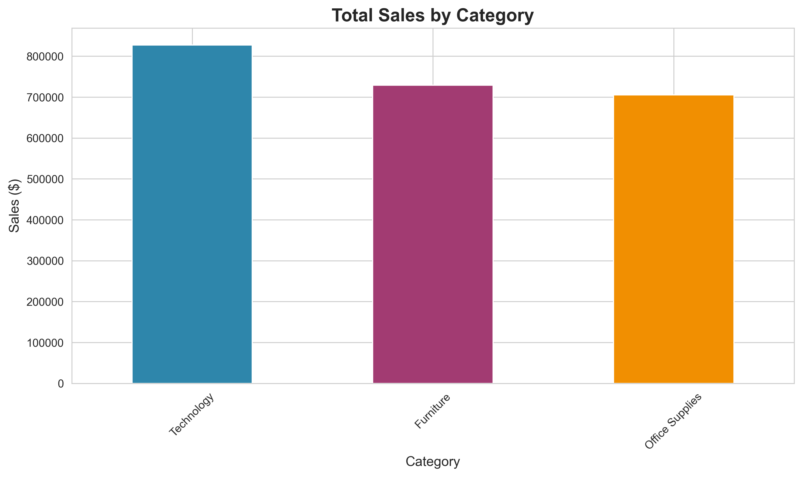
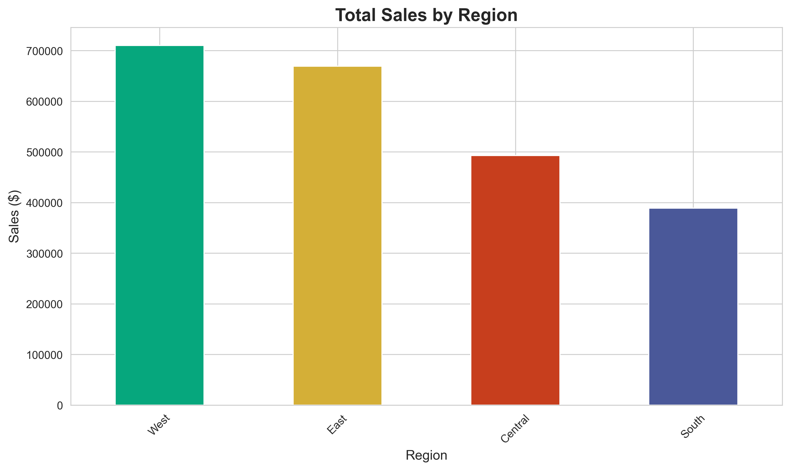
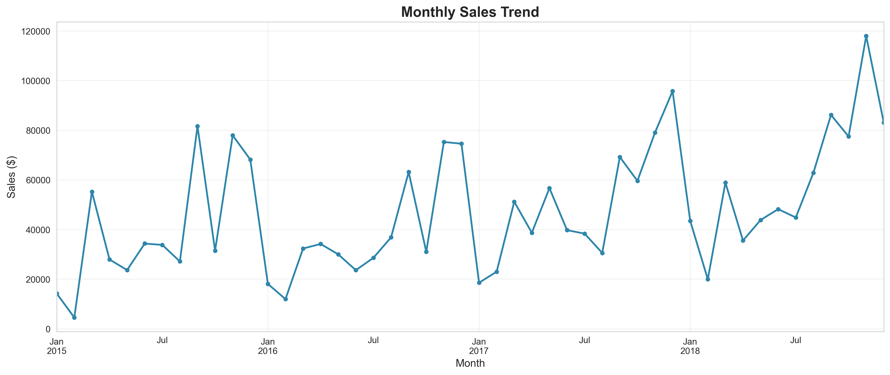
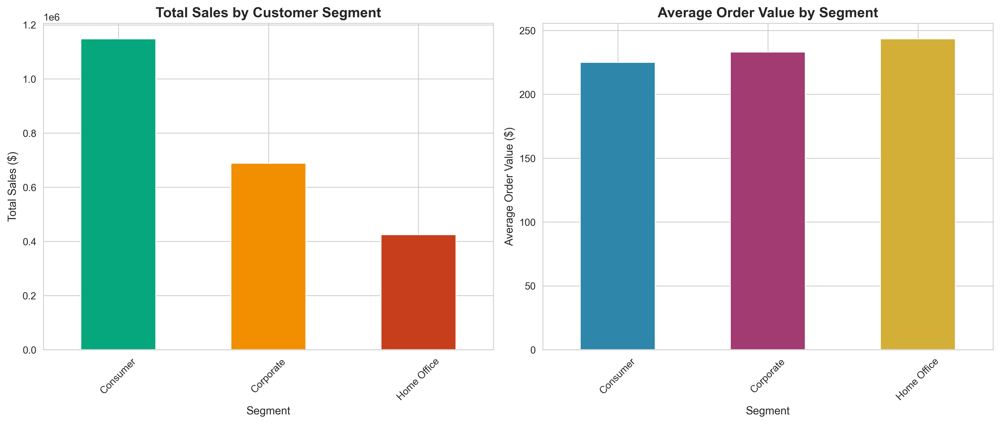
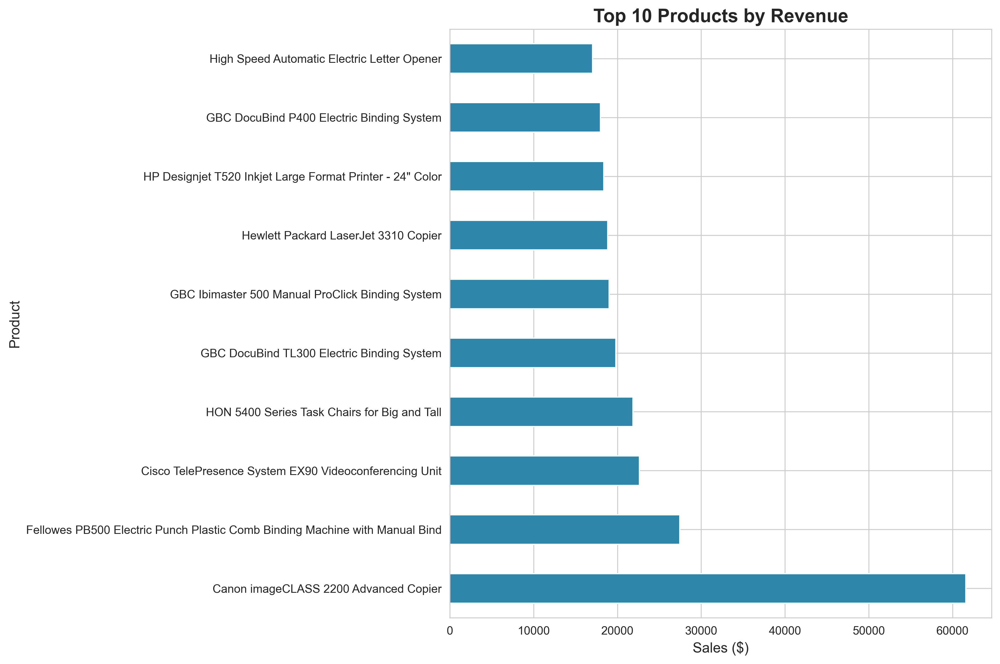

# Retail Sales Analysis

A complete data analysis project analyzing retail sales patterns using Python and creating interactive visualizations.

## 📊 Project Overview

This project analyzes a retail dataset containing 9,800 orders across multiple product categories, regions, and customer segments. The goal is to identify sales trends, top-performing products, and customer behavior patterns to provide actionable business insights.

## 🎯 Business Questions Answered

1. **What are our top-selling categories?**
2. **Which regions generate the most revenue?**
3. **What are our sales trends over time?**
4. **Which customer segments are most valuable?**
5. **What are our best-selling products?**

## 🔑 Key Insights

### Revenue Overview
- **Total Revenue**: $2.26M
- **Total Orders**: 9,800
- **Average Order Value**: $231

### Top Performers
- **Best Category**: Technology ($827K) - 37% of total revenue
- **Best Region**: West ($710K)
- **Best Customer Segment**: Consumer ($1.15M across 5,101 orders)

### Time Analysis
- **Peak Sales Month**: November 2018 ($117,938)
- **Data Range**: 2015-2018
- Clear seasonal patterns with Q4 peaks

### Product Performance
- Top product: Canon imageCLASS 2200 Advanced Copier ($61,599)
- Technology products dominate top 10

## 📁 Project Structure
```
retail-sales-analysis/
│
├── train.csv                    # Original dataset
├── train_cleaned.csv            # Cleaned dataset
├── data_cleaning.py             # Data cleaning script
├── analysis.py                  # Analysis and visualization script
│
├── category_sales.png           # Sales by category chart
├── region_sales.png             # Sales by region chart
├── sales_trend.png              # Monthly sales trend
├── segment_analysis.png         # Customer segment analysis
├── top_products.png             # Top 10 products
│
└── README.md                    # Project documentation
```

## 🛠️ Technologies Used

- **Python 3.x**
- **pandas** - Data manipulation and analysis
- **matplotlib** - Data visualization
- **seaborn** - Statistical visualizations

## 📈 Visualizations

### Sales by Category


### Regional Performance


### Monthly Sales Trend


### Customer Segment Analysis


### Top 10 Products


## 🚀 How to Run

1. **Clone the repository**
```bash
git clone https://github.com/salvisa/retail-sales-analysis.git
cd retail-sales-analysis
```

2. **Install required packages**
```bash
pip install pandas matplotlib seaborn
```

3. **Run data cleaning**
```bash
python data_cleaning.py
```

4. **Run analysis**
```bash
python analysis.py
```

## 📊 Data Cleaning Process

- Converted date columns to proper datetime format
- Handled 11 missing postal codes (filled with 0)
- Verified no duplicate records
- Standardized data types across all columns

## 💡 Business Recommendations

Based on the analysis:

1. **Focus on Technology**: Technology category drives 37% of revenue - consider expanding product line
2. **Regional Strategy**: West region outperforms others - investigate success factors for replication
3. **Consumer Segment**: Priority segment with highest order volume - tailor marketing accordingly
4. **Seasonal Planning**: November shows peak sales - optimize inventory and marketing for Q4
5. **High-Value Products**: Canon copiers generate significant revenue - ensure stock availability

## 📫 Contact

**Sarvesh Salvi**
- GitHub: [@salvisa](https://github.com/salvisa)
- Project Link: [https://github.com/salvisa/retail-sales-analysis](https://github.com/salvisa/retail-sales-analysis)

---

*This project was created as part of my data analyst portfolio to demonstrate data cleaning, analysis, and visualization skills.*
