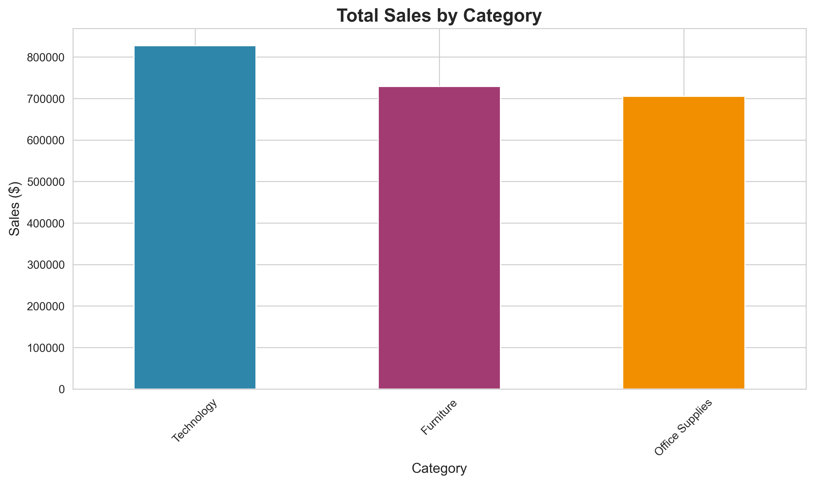
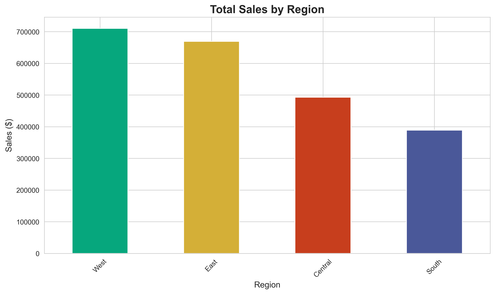
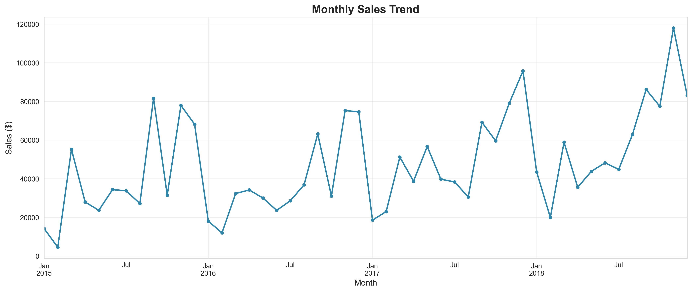
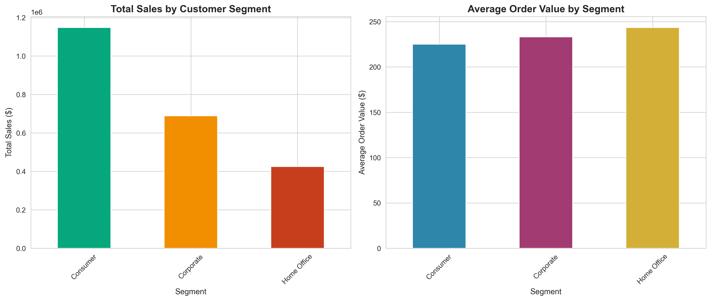
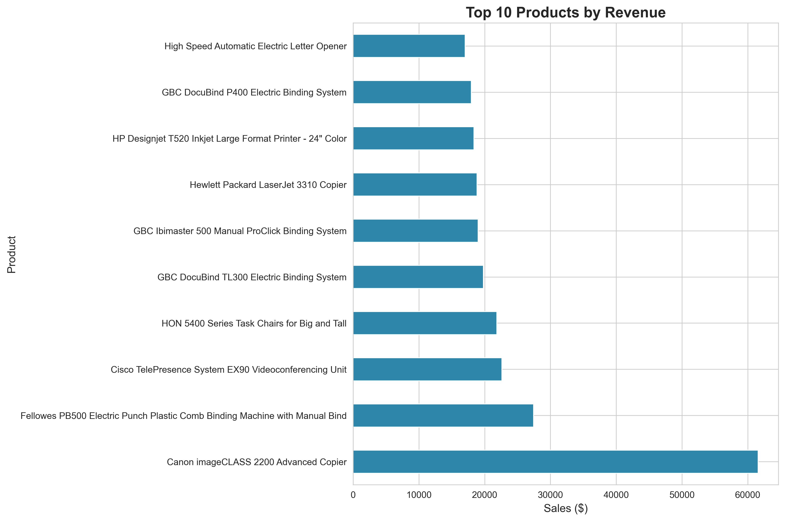

# 🛒 Retail Sales Analysis – Python & Tableau

An end-to-end data analysis project examining **$2.26M in retail sales** across 9,800 orders (2015–2018), uncovering revenue trends, customer segment behavior, and product performance to deliver actionable business recommendations.

Built with Python (Pandas, Matplotlib, Seaborn) with visualizations designed for business stakeholder consumption.

---

## 🎯 Business Questions Answered

1. Which product categories drive the most revenue — and by how much?
2. Which regions outperform, and what does that mean for resource allocation?
3. What are the seasonal sales patterns, and when should inventory be optimized?
4. Which customer segments generate the highest order volume and value?
5. Which specific products are the top revenue contributors?

---

## 🔑 Key Findings

| Metric | Value |
|---|---|
| Total Revenue | $2.26M |
| Total Orders | 9,800 |
| Average Order Value | $231 |
| Best Category | Technology ($827K — 37% of revenue) |
| Best Region | West ($710K) |
| Top Customer Segment | Consumer ($1.15M, 5,101 orders) |
| Peak Sales Month | November 2018 ($117,938) |
| Data Range | 2015–2018 |
| Top Product | Canon imageCLASS 2200 Advanced Copier ($61,599) |

---

## 💡 Business Recommendations

1. **Double down on Technology** — at 37% of total revenue, Technology is the dominant category. Expanding the product line here has the clearest ROI
2. **Replicate West region success** — West outperforms all other regions by $40K+. Investigating its sales motion could unlock growth in Central and South
3. **Prioritize Consumer segment** — highest order volume (5,101 orders) makes this the most scalable segment for targeted marketing campaigns
4. **Plan for Q4 seasonality** — November consistently peaks; inventory and marketing budgets should be front-loaded for Q4
5. **Protect top SKUs** — Canon copiers alone contributed $61.6K. Stock availability for top-10 products directly protects revenue

---

## 📊 Visualizations

### Sales by Category


### Regional Performance


### Monthly Sales Trend (2015–2018)


### Customer Segment Analysis


### Top 10 Products by Revenue


---

## 🛠️ Tech Stack

| Tool | Purpose |
|---|---|
| Python (Pandas) | Data cleaning, transformation, analysis |
| Matplotlib & Seaborn | Statistical visualizations |
| Tableau | Interactive dashboard (available upon request) |

---

## 📁 Project Structure

```
retail-sales-analysis/
├── train.csv                # Original dataset (9,800 orders)
├── train_cleaned.csv        # Cleaned dataset
├── data_cleaning.py         # Data cleaning and preprocessing script
├── analysis.py              # Analysis and visualization script
├── category_sales.png       # Sales by category chart
├── region_sales.png         # Regional performance chart
├── sales_trend.png          # Monthly sales trend (2015–2018)
├── segment_analysis.png     # Customer segment breakdown
├── top_products.png         # Top 10 products by revenue
└── README.md
```

---

## 🧹 Data Cleaning Process

- Converted date columns to proper datetime format for time-series analysis
- Handled 11 missing postal codes (filled with mode per region)
- Verified zero duplicate records across all 9,800 orders
- Standardized data types and column formats across all fields

---

## 🚀 How to Run

```bash
# 1. Clone the repository
git clone https://github.com/salvisa/retail-sales-analysis.git
cd retail-sales-analysis

# 2. Install dependencies
pip install pandas matplotlib seaborn

# 3. Run data cleaning
python data_cleaning.py

# 4. Run analysis and generate visualizations
python analysis.py
```

---

## 👤 Author

**Sarvesh Salvi**
M.S. Information Systems, Northeastern University
[LinkedIn](https://linkedin.com/in/sarvesh-salvi) · [GitHub](https://github.com/salvisa)
